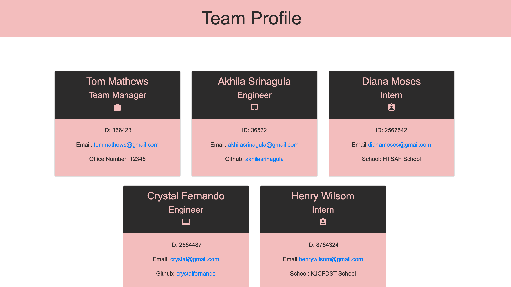

# 10-Team-Profile-Generator

## License

# Description

Node.js command-line application that takes in information about employees on a software engineering team and generates an HTML webpage that displays summaries for each person.

# Installation

To Install all the dependencies run npm i or npm install on the command line

Ensure Inquirer and Jest are installed

# Usage

To run the application , from the root folder type node index and answer the questions and once the application runs, it will generate an index.html file in the "dist" folder. 

# Demo

https://watch.screencastify.com/v/Yo7UhPeq9ATFK3QMtJM2

# Screenshot of example HTML file

#GitHub Repo Link : 

# Tests

To run the tests for this application, enter npm run test on the command line

# Questions

If you have any questions about the project, contact me at akhilasrinagula@gmail.com
